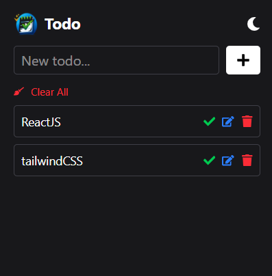

#  Todo Chrome Extension


A clean and minimal **Todo Chrome Extension** built using **React, Vite, Tailwind CSS**, and **Chrome Storage API**.  
This extension helps users manage daily tasks directly from the browser toolbar with persistent storage and dark mode support.

## 📸 Screenshots




---


## 🚀 Features

- ➕ Add new todos
- ✏️ Edit existing todos
- ✅ Mark todos as completed
- 🗑️ Delete individual todos
- 🧹 Clear all todos at once
- 💾 Data stored locally using Chrome Storage API
- ⚡ Built with React + Vite for fast performance
- 🎨 Styled with Tailwind CSS
- 🎯 Uses React Icons for clean UI

---

## 🧱 Tech Stack

- **React**
- **Vite**
- **Tailwind CSS**
- **Chrome Extension (Manifest v3)**
- **Chrome Storage API**
- **React Icons**

---

## 📁 Project Structure

```text
todo-extension/
├── public/
│   ├── manifest.json
│   └── logo.png
├── src/
│   ├── App.jsx
│   ├── main.jsx
│   ├── index.css
│   └── utils/
│       └── storage.js
├── dist/           
├── index.html
├── vite.config.js
└── package.json
```


---

## 🛠️ Local Development

### Clone the repository
```bash
git clone <https://github.com/devajaypndey/chrome-extension-todo.git>
cd todo-extension
npm install
npm run dev
```

### Build for Chrome Extension
```bash
npm run build
```

### Install Extension in Chrome (Without Chrome Web Store)
1. Open Google Chrome and go to: **chrome://extensions**

2. Enable **Developer Mode**

3. Click **Load unpacked**

4. Select the **dist/** folder

